# Pprerequisite

- 1 python 3.8 :https://www.python.org/downloads/release/python-380/
- 2 github account:https://github.com/
- 3 visual studio code: https://code.visualstudio.com/download
- 4 download obs for video recording: https://obsproject.com/
- 5 download git for version control https://git-scm.com/downloads/

git config --global user.name "Your Name"

git config --global user.email "your_email@example.com"

Install following extension in vs code

autoDocstring
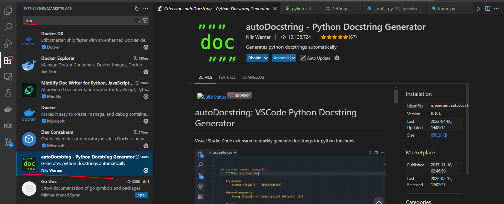

Python
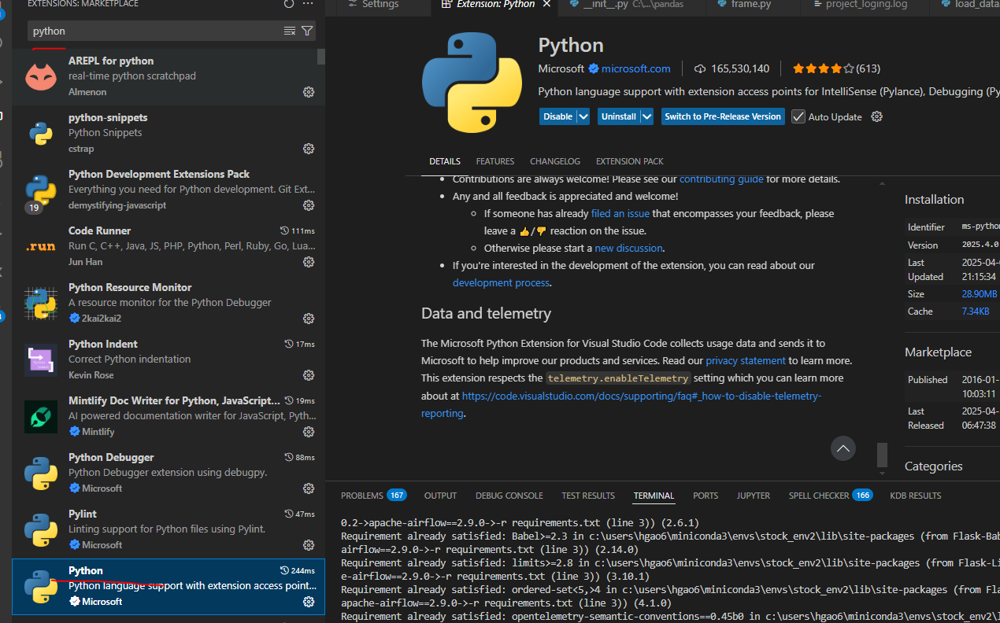

### Lesson1 预习资料

1.what is a virtual environment https://www.youtube.com/watch?v=Y21OR1OPC9A

2.Github 101 https://www.youtube.com/watch?v=SD7YNLv5Evc

把自己的代码提交到 remote 4 步走

1. stage(站台）
2. write commit message
3. commit(乘客上车)
4. push(发车)

### Lesson2 预习资料

Static code analysis tool

- pylint: check your code style, enforces coding standard and make suggestions about how the code could be refactored recommend by PEP8(a python tyle guide) and rate it from 0-10. 💡Interview questions: what is pep 8 （answers:https://realpython.com/python-pep8/#:~:text=PEP%208%2C%20sometimes%20spelled%20PEP8,and%20consistency%20of%20Python%20code.)
- black: format your code automatically
- isort: sort the libraries import in your project

### Task 1

- 1. create main.py, extract_data.py, load_data.py, transform.py
- 2. create requirements.txt file that has contents below

```
apache-airflow==2.9.0
nltk==3.8.1
numpy==1.24.4
pandas==1.3.5
SQLAlchemy==1.4.36
yfinance==0.2.56
mysqlclient==2.2.0
mysql-connector-python==8.3.0
tiingo==0.14.0
pylint==2.17.7
black==23.3.0
isort==5.9.3
```

- 3. create virtual environment by running python -m venv venv
- 4. activate virtual environment by running venv\scripts\activate
- 4. run pip install -r requirements.txt
- 5. familiar yourself with use yahoo finance api by looking at example here
     [Yahoo finance api example file](./samples/yahoo_finance_api_usage_example.py)
- 6. create two functions in extrac_data.py see below

```python
def get_stock_history(stock:str,period:str,interval:str)->pd.DataFrame:
    '''this function should pull stock history given a stock input,
       please follow this link to get example on how to use yahoo finance api
       https://github.com/ranaroussi/yfinance
    '''


def get_stock_history(stock:str,start_date:str,end_date:str, interval:str)->pd.DataFrame:
    ''' Now try to add cache to this function to save api call as too many api calls would hit rate limit on yahoo finance
modify our get_stock_history function above to read data from cache folder(need to create this folder in our project directory)
if cache file exist. Save our cache file in the format of  cache_filename = f"{stock}_{start_date}_{end_date}.csv"
    '''


```

it should return a data frame like this below

<!--  -->
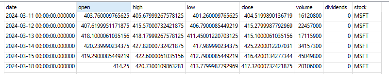

When creating functions, please add type hinting and doc string like below

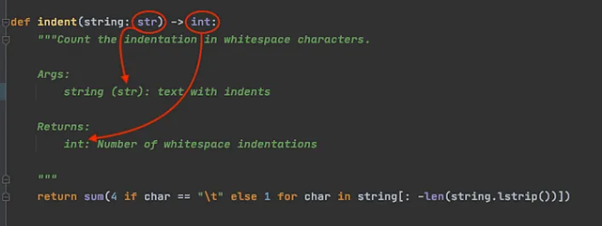

### Task 2

```python
1. add a function called get_exchange_rate to extract_data.py so it can download fx rate for us
def get_exchange_rate(from_currency, to_currency, interval):
    fx_rate_ticker = f"{from_currency}{to_currency}=X"
    fx_rates = yf.download(fx_rate_ticker, period=period, interval=interval)


```

and output should look like below

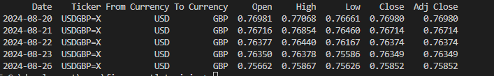

```python
2. add a function called get_stock_currency_code so that we know what currency this stock belongs to
def get_stock_currency_code(stock:str)->str:
    #hint look attribute in fast_info property

```

```python


3. add function called get_news to extract_data.py so we can get relevant news belongs to that company
def get_news(stock:str)->str:
```

and output should look like below

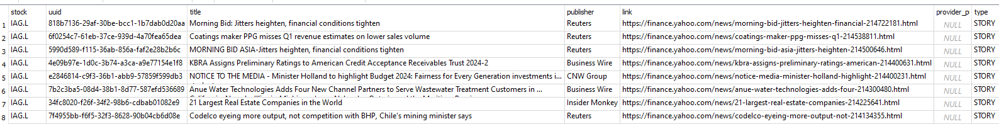

4. Add a new python file called transform_data.py and it should round open, high, low, close columns to 2 decimal places
   and rename data column to trade_date

```Python
def normalize_stock_data(stock_history: pd.DataFrame) -> pd.DataFrame:

```

### Task 3

1. creat function as below to transform data.py

```python
def add_stock_returns(stock_history:pd.DataFrame)->pd.DataFrame:
    """
    This function adds two columns to stock_history data frame
        a. "daily_return": this is caluclated using the "close" price column, google "how to calcualte daily return pandas"
        b. "cummulative_return": this is caculated using the "daily_return" caculated from step above(see stackoverflow below)
        https://stackoverflow.com/questions/35365545/calculating-cumulative-returns-with-pandas-dataframe
    """

```

2. The stock price we get is denominated in local currency and we want to convert it to USD, in order to achieve this, we need
   2.1 add a new column called currency_code(use the function get_stock_currency_code created from task 2 ) to stock history data frame in our get_stock_history function
   2.1 add new function called standardize_price_to_usd like below, this function should first get the fx rate from whatever local currency to usd and then apply it to existing close price column to get a usd_close price column

   note: you can use "SHOP.TO" to test it's the canadian stock ticker for canadian company called SHOPIFY, it should return canadian stock price when we our get_stock_history function runs and we need to get CAD/USD fx rate and convert CAD price
   to USD price

```python
   def standardize_price_to_usd(stock_history:pd.DataFrame)->pd.DataFrame:

```


3. finish calculate_moving_average function so it calculate the moving average of stock close price

```python

def calculate_moving_average(stock_history: pd.DataFrame, window: int = 5) ->pd.DataFrame:

```

4. finish get_top_bottom_days function below so it returns stock history data with top n days and bottom n days by price for sepecific ticker

```python
def get_top_bottom_days(stock_history: pd.DataFrame, ticker:str, top_n: int = 5, ) -> pd.DataFrame:


```

5. finish group_by_sector function below so it calculates the average stock close price and volume by each sector

```python
def group_by_sector(stock_history: pd.DataFrame) -> pd.DataFrame:


```

### Task 4

1. create load_data.py file and create function inside like below that save dataframe to mysql db

```python
 def save_df_to_db(
    df, table_name, if_exists="append", dtype=None,
) -> None:
    """
    Function to send a dataframe to SQL database.

    Args:
        df: DataFrame to be sent to the SQL database.
        table_name: Name of the table in the SQL database.
        if_exists: Action to take if the table already exists in the SQL database.
                   Options: "fail", "replace", "append" (default: "append").
        dtype: Dictionary of column names and data types to be used when creating the table (default: None).


    Returns:
        None. This function logs a note in the log file to confirm that data has been sent to the SQL database.
    """
```

some helpful code snippet

```python

from sqlalchemy import create_engine #1. import sqlalchemy library(used for interact with db using pandas)
ENGINE = create_engine(f"mysql+mysqlconnector://<user_name>:<pass_word>@localhost/<db_name>") #2. create engine
df.to_sql() #4. final step of saving dataframe to db, see pandas documents on how to pass the requried parameterss
# https://pandas.pydata.org/docs/reference/api/pandas.DataFrame.to_sql.html
```

see video below to setup mysql
https://www.youtube.com/watch?v=u96rVINbAUI

for mac user, you need to run brew install mysql pkg-config
https://stackoverflow.com/questions/66669728/trouble-installing-mysql-client-on-mac

2. now we have our functions in extract_data.py, transform_data.py, load_data.py. it's time to connect them together in main.py module
   please add this run_pipeline function to main.py so that it takes a list of tickers to do following things:

- 2.1 it downloading data from yaohoo finance api by calling get_stock_history,get_stock_financials, get_news
- 2.2 enrich stock history data using add_stock_returns, standardize_price_to_usd, normalize_stock_data, calculate_moving_average
- 2.3 saved enriched stock history, news data, financial data to "stock_history" , "news", "financial" tables in mysql database respectively

```python
def run_pipeline(
    tickers: List[str],
    period: str = "1d",
    interval: str = "1d",
)->None:

```

### Task 5

1. add logging to your project and add different type of logs wherever applicable
   https://realpython.com/python-logging/
   https://www.youtube.com/watch?v=urrfJgHwIJA

```python
import logging

logging.basicConfig(format='%(asctime)s - %(message)s', level=logging.INFO)
logging.info('Admin logged in')
```

2. add unit testing(use pytest, see youtube video below) for 3 functions one for add_stock_returns and one for normalize_stock_data and one for calculate_moving_average
   https://www.youtube.com/watch?v=cHYq1MRoyI0&t=716s

### Task 6 dockerize your project

hands-on tutorial created by myself
https://github.com/hgao62/docker_tutorial

docker tutorials- How To Containerize Python Applications
https://www.youtube.com/watch?v=bi0cKgmRuiA

docker compose tutorial
https://www.youtube.com/watch?v=HG6yIjZapSA&t=1598s

## Task 7 How to set up airflow

apache airflow in half an hour(only need to watch first 4 videos)
https://www.youtube.com/watch?v=s6PgXq-SO4I&list=PLc2EZr8W2QIAI0cS1nZGNxoLzppb7XbqM

## Task 8 Deploy app to google cloud

youtube tutorial
https://www.youtube.com/watch?v=7CvD6oHmYxU

###First part push impage to docker hub ########

1. login into docker hub
   https://hub.docker.com/repository/docker/kobegao/fastapi/general
   username：kobegao
   password:g7389010!

2. build image
   2.1 docker build -t kobegao/fastapi:1.0.01(increase this yourself) .
   2.2 docker login
   2.3 docker push kobegao/fastapi:1.0.0(push to docker hub)

###First part push impage to docker hub ########

####Second part configure cloud run ############ 3. go to google cloud run https://console.cloud.google.com/ 4. click "Create Service"

need to set up billing payment and enable

docker pull kobegao/fastapi:1.0.0
2 docker login
3 docker pull kobegao/fastapi:1.0.0
4 docker tag kobegao/fastapi:1.0.0 gcr.io/fast-api-project-399403/<image name>
5 docker push gcr.io/fast-api-project-399403
6 gcloud init
7 gcloud auth configure-docker
8 docker-credential-gcloud list
9 docker push gcr.io/fast-api-project
10 docker tag kobegao/fastapi:1.0.0 gcr.io/fast-api-project-399403do/fastapi-image-google
11 docker push gcr.io/fast-api-project-399403/fastapi-image-google

kobegao/restaurant_dashboard
aws
docker push kobegao/restaurant_dashboard:1.0.1
docker pull kobegao/restaurant_dashboard:1.0.1

docker push kobegao/fastapi:1.0.1
docker pull kobegao/fastapi:1.0.1

####Second part configure cloud run ############

#### 1. build image and create a container based on the image just created

```docker
  docker-compose up --build
```

### Useful docker commands

1. list all local images

```docker
docker image ls

```

### Useful Airflow commands

1. start airflow scheduler

```
airflow scheduler

```

2. list all dags

```
airflow dags list
```

3. check current executor type

```
airflow config get-value core executor
```

### how to run mysql commands within docker container

```
mysql -u root -p

```

delete all local docker images, run command line below in powershell
https://stackoverflow.com/questions/44785585/how-can-i-delete-all-local-docker-images

```
docker images -a -q | % { docker image rm $_ -f }
```

future enhancement amazon managed apache airflow
https://www.youtube.com/watch?v=jky0q1rLfPE

### Connect Power BI with mysql

https://www.youtube.com/watch?v=gvs_BYYoDOM

### Connect Tableau with mysql

https://www.youtube.com/watch?v=aCVp5vEDNMM&t=212s

#### complete the cd part

1. youtube tutorial
   https://www.youtube.com/watch?v=kZYsoav104w

#########aws note####

1. login into aws cli by typing aws in command line
2. login using command C:\Users\hgao6>aws ecr get-login-password --region us-east-2 | docker login --username AWS --password-stdin 847098449920.dkr.ecr.us-east-2.amazonaws.com
   (credientials is sotred in c:\users\hgao6\.aws\credentials
   docker pull kobegao/fastapi:1.0.0
3. docker tag kobegao/fastapi:1.0.1(image name) 847098449920.dkr.ecr.us-east-2.amazonaws.com/kobegao/restaurant_dashboard(source server name)
4. docker push 847098449920.dkr.ecr.us-east-2.amazonaws.com/kobegao/restaruant_dashboard:latest

#1. add pytest to requirements.txt
#2. add task to connect main.py with etl modules
#3. add Enum instructions

# how to set up github action continous deployment

1. login into google cloud to get secret
   https://console.cloud.google.com/iam-admin/serviceaccounts/details/115521249260056891987/keys?inv=1&invt=AbiRNA&project=dashapp-399621
   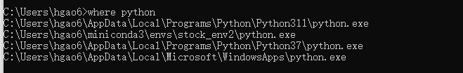
   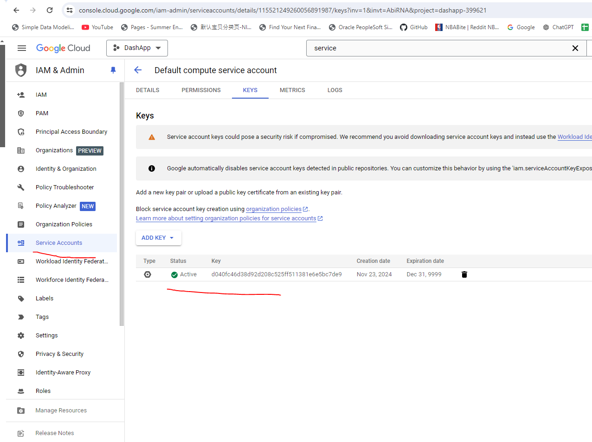

2. add secret to github
   https://github.com/hgao62/finance_etl_training/settings/secrets/actions
   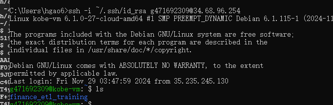

3. create github action

aws ci/cd
https://aws.amazon.com/blogs/containers/automated-software-delivery-using-docker-compose-and-amazon-ecs/

1. Use AWS ECS (Elastic Container Service) with Docker Compose
   AWS supports deploying Docker Compose applications directly to Amazon ECS. This is the most seamless way to run Docker Compose applications on AWS.

Steps to Deploy Compose Applications to ECS:
Install the AWS CLI and Docker Compose CLI plugin:

Ensure you have the AWS CLI installed.
Install the Docker Compose CLI for ECS: Docker ECS CLI Plugin.
Authenticate the AWS CLI:

bash
Copy code
aws configure
Provide your AWS access key, secret key, and region.

Convert Compose File for ECS: If you have a docker-compose.yml file, you can deploy it directly to ECS with minimal changes.

Deploy Your Application: Run the following command in the directory with your docker-compose.yml:

bash
Copy code
docker compose up
This will:

Create an ECS cluster (if not already created).
Deploy your services as ECS tasks.
Configure load balancers and other resources as defined in the Compose file.
Monitor Services:

Go to the AWS Management Console > ECS to view the running services.
Use docker compose ps to view running tasks and their endpoints.


####### How to setup AWS ecs CD pipeline############

Grant Required IAM Permissions

0. add permission to create ECR repository


1. Create an ECR Repository

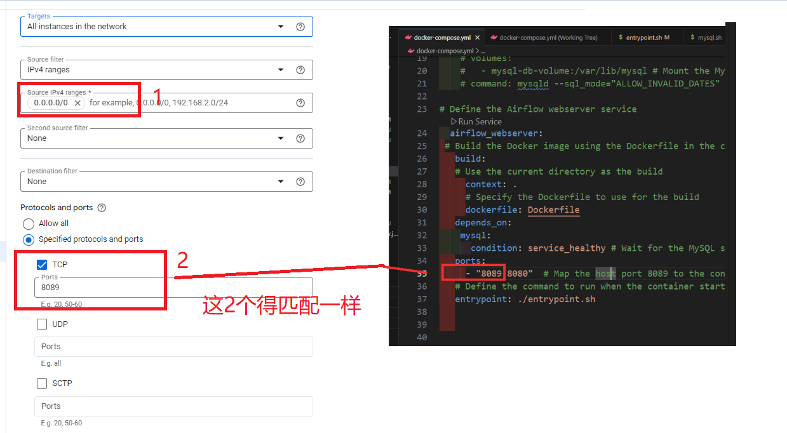

2. update workflow environment variable
   env:
   ECR_REPOSITORY: 'my-ecr-repo' # Replace with the name of your ECR repository
   AWS_REGION: 'us-east-2' # Replace with the AWS region of your repository

3. Authenticate Docker to Your ECR Repository
   aws ecr get-login-password --region us-east-2 | docker login --username AWS --password-stdin <account-id>.dkr.ecr.us-east-2.amazonaws.com
   Replace <account-id> with your AWS account ID (12-digit number).
   Replace us-east-2 with your AWS region.
   aws ecr get-login-password --region us-east-2 | docker login --username AWS --password-stdin 992382444957.dkr.ecr.us-east-2.amazonaws.com

4. create ecr service
   

access container from terminal

1. run docker ps

How to Deploy a Multi Container Docker Compose Application On Amazon EC2

https://everythingdevops.dev/how-to-deploy-a-multi-container-docker-compose-application-on-amazon-ec2/

### How to deploy app to google cloud compute engine

1. create vm on google cloud
   
   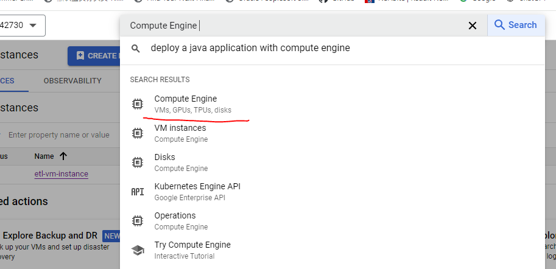

1.1
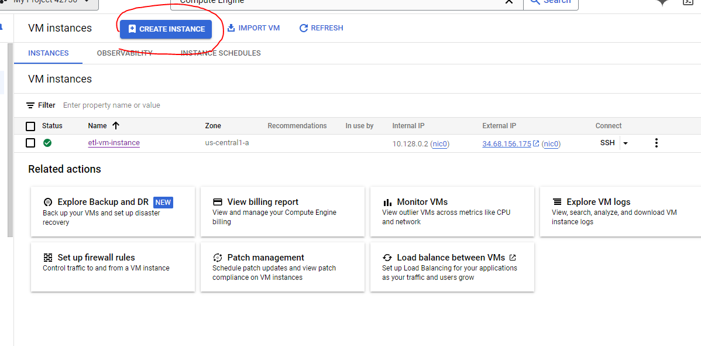 2. leave everything else as default except for changing this below(cheapest option) and click create

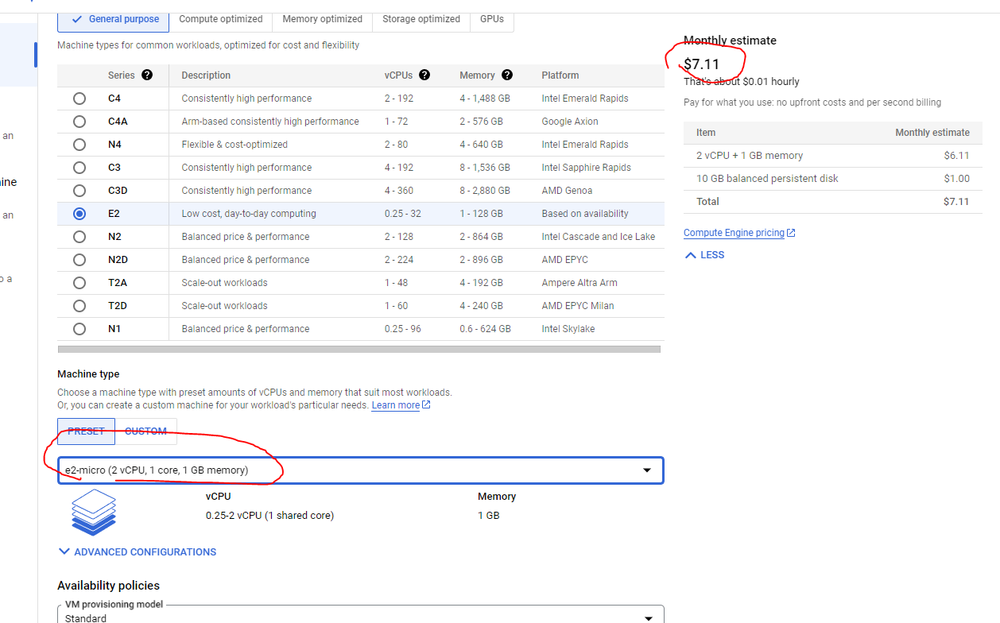
3. connect to your vm terminal by clicking ssh as below
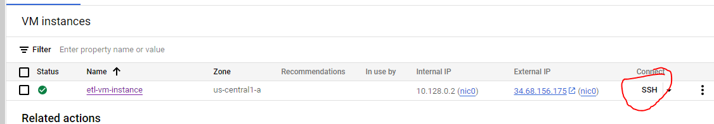
4. follow steps below to allow vm to clone from your repo

### How to authenticate vm to clone from your repo

1. generate new ssh key
   ssh-keygen -t ed25519 -C "your_email@example.com"(replace with your email)
   ssh-keygen -t ed25519 -C "hgao62@uwo.ca"
2. add ssh key to the ssh agent
   2.1 start ssh agent
   eval "$(ssh-agent -s)"
   2.2 Add your SSH private key to the agent:
   ssh-add ~/.ssh/id_ed25519
3. copy your public key to github
   cat ~/.ssh/id_ed25519.pub

3.1 open your github setting page and click "SSH and GPG keys"

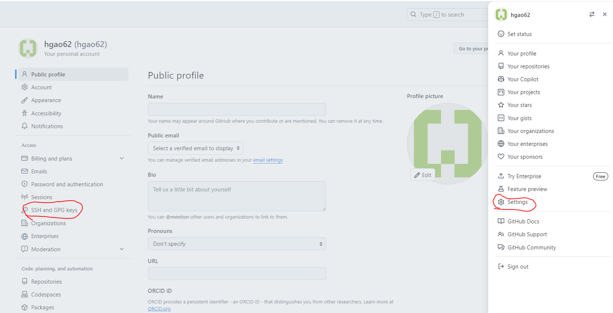

3.2 click "New SSH key"
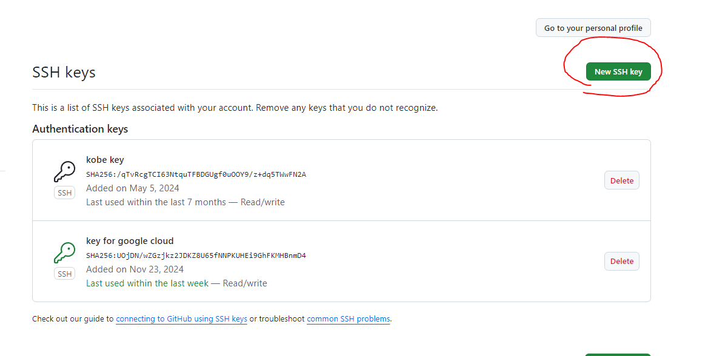

4. test your ssh key works with github by running command below
   ssh -T git@github.com

all the commands you need to run in one screenshot

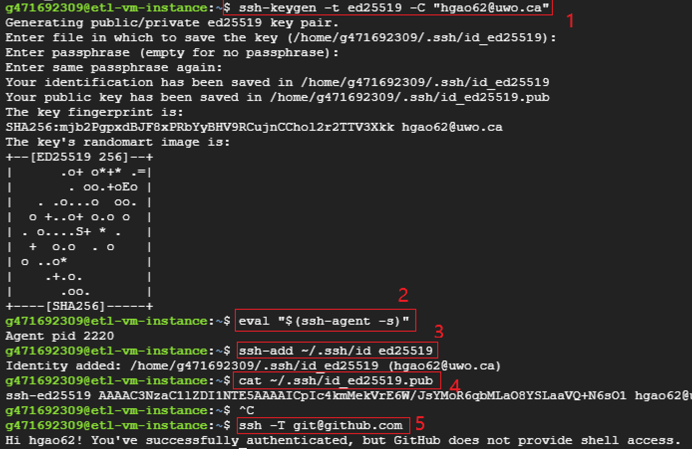

5. run
   git clone <ssh path as shown in screenshot below>
   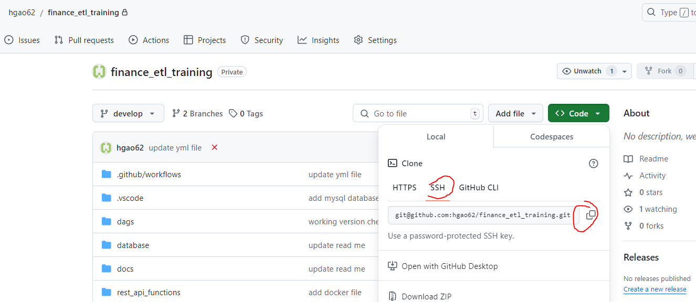

### How to authenticate vm to clone from your repo

6. run:sudo usermod -aG docker $USER
7. run:logout
8. logout back in by click "SSH" ON VM(same as step 3 above)
9. run: test command below to make sure no error
   docker ps
10. run: docker-compose up --build

11. if experience finance_etl_training_airflow_webserver_1 exited with code 127
    run: sudo apt install dos2unix
    and then run:dos2unix entrypoint.sh

12. create fire wall rules by following below
    Firewall Configuration: Ensure that your VM’s firewall rules allow inbound traffic on port 8080. You can verify this in the Google Cloud Console under VPC Network > Firewall:

Look for a rule that allows traffic on port 8080.
If there’s no rule, create one:
Go to VPC Network > Firewall Rules.
Click Create Firewall Rule.
Set the following:
Name: allow-airflow-8080.
Targets: All instances in the network or specify your instance.
Source IP ranges: 0.0.0.0/0 (to allow access from anywhere).
Protocols and ports: Select TCP and specify port 8080.

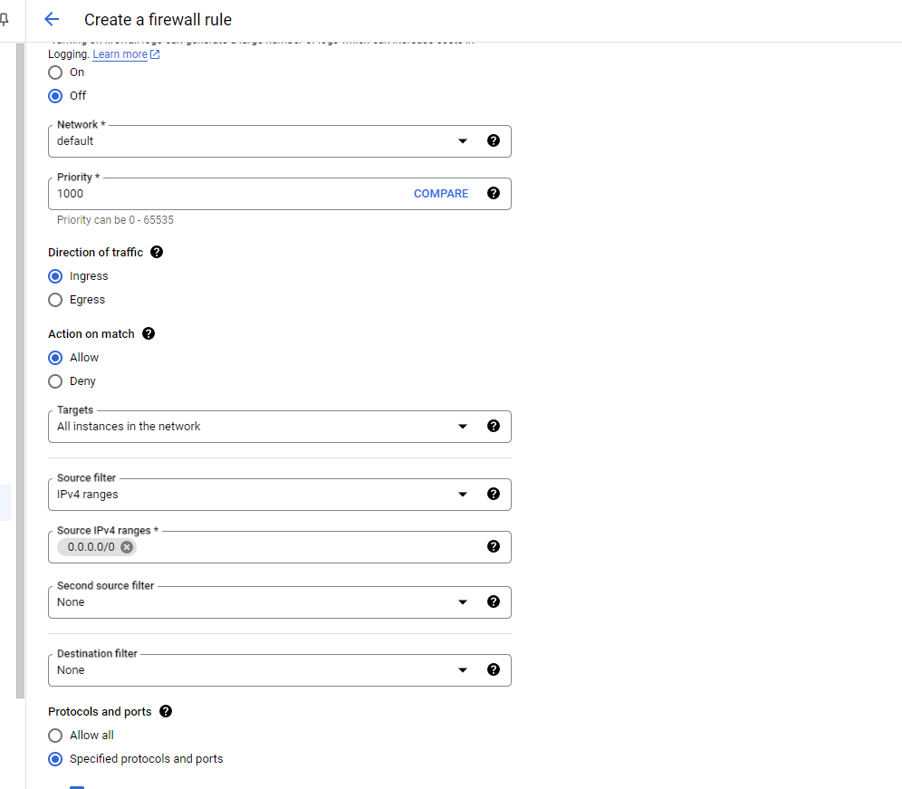

### Use docker exec to Run Commands in a Running Container

1. docker ps
2. docker exec -it <container_name_or_id> sh
3. run your command

### Commonly experienced issue

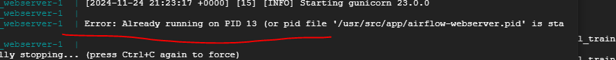

this means airflow is still running on a stale file(look for airflow process)
ps aux | grep airflow
