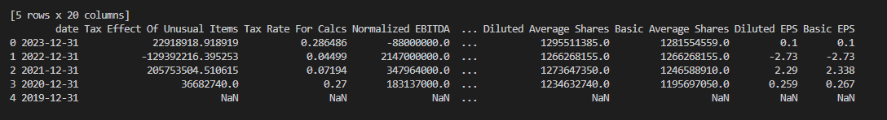

# Pprerequisite
- 1 python 3.7.9:https://www.python.org/downloads/release/python-379/
- 2 github account:https://github.com/
- 3 visual studio code: https://code.visualstudio.com/download
- 4 download obs for video recording: https://obsproject.com/

## Github repo
https://github.com/hgao62/vera_project.git
### Task 1
* 1. create main.py, extract_data.py, load_data.py, transform.py
* 2. create requirements.txt file that has contents below
```
SQLAlchemy==1.4.52
yfinance==0.2.37
pandas>=1.3.0
numpy>=1.21.0
```
* 3. create virtual environment by running python -m venv venv
* 4. activate virtual environment by running venv\scripts\activate
* 4. run pip install -r requirements.txt
* 5. familiar yourself with  use yahoo finance api by looking at example here
    [Yahoo finance api example file](./samples/yahoo_finance_api_usage_example.py)
* 6. create two functions in extrac_data.py see below

```python
def get_stock_history(stock:str,period:str,interval:str)->pd.DataFrame:
    '''this function should pull stock history given a stock input,
       please follow this link to get example on how to use yahoo finance api
       https://github.com/ranaroussi/yfinance
    '''


```
it should return a data frame like this below

<!--  -->


```python
def get_stock_financials(stock:str)->pd.DataFrame:
    '''this function should get share holders of a stock given a stock input, it should have 
       following output columns
       please follow this link to get example on how to use yahoo finance api
       https://github.com/ranaroussi/yfinance
    '''

    output_columns = [
        "Ticker",
        "Date",
        "Tax Effect Of Unusual Items",
        "Tax Rate For Calcs",
        "Normalized EBITDA",
        "Net Income From Continuing Operation Net Minority Interest",
        "Reconciled Depreciation",
        "Reconciled Cost Of Revenue",
        "EBITDA",
        "EBIT"
    ]

```
it should return a data frame like this below




When creating functions, please add type hinting and doc string like below


### Task 2
```python
1. add a function called get_exchange_rate to extract_data.py so it can download fx rate for us
def get_exchange_rate(from_currency, to_currency, interval):
    fx_rate_ticker = f"{from_currency}{to_currency}=X"
    fx_rates = yf.download(fx_rate_ticker, period=period, interval=interval)


```
and output should look like below


```python
2. add a function called get_stock_currency_code so that we know what currency this stock belongs to
def get_stock_currency_code(stock:str)->str:
    #hint look attribute in fast_info property

```

```python


3. add function called get_news to extract_data.py so we can get relevant news belongs to that company
def get_news(stock:str)->str:
```
and output should look like below


4. Add a new python file called transform_data.py and it should round open, high, low, close columns to 2 decimal places
and rename data column to trade_data
```Python
def normalize_stock_data(stock_history: pd.DataFrame) -> pd.DataFrame:

```


### Task 3
1. creat function as below to transform data.py
```python
def add_stock_returns(stock_history:pd.DataFrame)->pd.DataFrame:
    """
    This function adds two columns to stock_history data frame
        a. "daily_return": this is caluclated using the "close" price column, google "how to calcualte daily return pandas"
        b. "cummulative_return": this is caculated using the "daily_return" caculated from step above(see stackoverflow below)
        https://stackoverflow.com/questions/35365545/calculating-cumulative-returns-with-pandas-dataframe
    """

```
2. The stock price we get is denominated in local currency and we want to convert it to USD, in order to achieve this, we need
   2.1 add a new column called currency_code(use the function get_stock_currency_code created from task 2 ) to stock history data frame in our get_stock_history function
   2.1 add new function called standardize_price_to_usd like below, this function should first get the fx rate from whatever local currency to usd and then apply it to existing close price column to get a usd_close price column


   note: you can use "SHOP.TO" to test it's the canadian stock ticker for canadian company called SHOPIFY, it should return canadian stock price when we our get_stock_history function runs and we need to get CAD/USD fx rate and convert CAD price 
   to USD price

```python
   def standardize_price_to_usd(stock_history:pd.DataFrame)->pd.DataFrame:

```


3. finish calculate_moving_average function so it calculate the moving average of stock close price 
```python

def calculate_moving_average(stock_history: pd.DataFrame, window: int = 5) ->pd.DataFrame:
   
```

4. finish get_top_bottom_days function below so it returns stock history data with top n days and bottom n days

```python
def get_top_bottom_days(stock_history: pd.DataFrame, n: int =5) -> pd.DataFrame:

   
```
5. finish group_by_sector function below so it calculates the average stock close price and volume by each sector

```python
def group_by_sector(stock_history: pd.DataFrame) -> pd.DataFrame:


```


### Task 4 
1. create load_data.py file and create function inside like below that save dataframe to mysql db
     
```python
 def save_df_to_db(
    df, table_name, if_exists="append", dtype=None,
) -> None:
    """
    Function to send a dataframe to SQL database.

    Args:
        df: DataFrame to be sent to the SQL database.
        table_name: Name of the table in the SQL database.
        if_exists: Action to take if the table already exists in the SQL database.
                   Options: "fail", "replace", "append" (default: "append").
        dtype: Dictionary of column names and data types to be used when creating the table (default: None).
        

    Returns:
        None. This function logs a note in the log file to confirm that data has been sent to the SQL database.
    """
```

some helpful code snippet
```python

from sqlalchemy import create_engine #1. import sqlalchemy library(used for interact with db using pandas)
ENGINE = create_engine(f"mysql+mysqlconnector://<user_name>:<pass_word>@localhost/<db_name>") #2. create engine
df.to_sql() #4. final step of saving dataframe to db, see pandas documents on how to pass the requried parameterss
# https://pandas.pydata.org/docs/reference/api/pandas.DataFrame.to_sql.html
```
see video below to setup mysql
https://www.youtube.com/watch?v=u96rVINbAUI

for mac user, you need to run brew install mysql pkg-config
https://stackoverflow.com/questions/66669728/trouble-installing-mysql-client-on-mac


2. now we have our functions in extract_data.py, transform_data.py, load_data.py. it's time to connect them together in main.py module
please add this run_pipeline function to main.py so that it takes a list of tickers to do following things:
 - 2.1 it downloading data from yaohoo finance api by calling get_stock_history,get_stock_financials, get_news
 - 2.2 enrich stock history data using add_stock_returns, standardize_price_to_usd, normalize_stock_data, calculate_moving_average
 - 2.3 saved enriched stock history, news data, financial data to "stock_history" , "news", "financial" tables  in mysql database respectively

```python 
def run_pipeline(
    tickers: List[str],
    period: str = "1d",
    interval: str = "1d",
)->None:

```


### Task 5

1. add logging to your project and add different type of logs wherever applicable
https://realpython.com/python-logging/
https://www.youtube.com/watch?v=urrfJgHwIJA 
```python
import logging

logging.basicConfig(format='%(asctime)s - %(message)s', level=logging.INFO)
logging.info('Admin logged in')
```
2. add unit testing(use pytest, see youtube video below) for 3 functions one for add_stock_returns and one for normalize_stock_data and one for calculate_moving_average
https://www.youtube.com/watch?v=cHYq1MRoyI0&t=716s


### Task 6 dockerize your project

hands-on tutorial created by myself
https://github.com/hgao62/docker_tutorial


docker tutorials- How To Containerize Python Applications
https://www.youtube.com/watch?v=bi0cKgmRuiA

docker  compose tutorial
https://www.youtube.com/watch?v=HG6yIjZapSA&t=1598s


## Task 7 How to set up airflow

apache airflow in half an hour(only need to watch first 4 videos)
https://www.youtube.com/watch?v=s6PgXq-SO4I&list=PLc2EZr8W2QIAI0cS1nZGNxoLzppb7XbqM


## Task 8 Deploy app to google cloud 
youtube tutorial
https://www.youtube.com/watch?v=7CvD6oHmYxU

###First part push impage to docker hub ########

1. login into docker hub
https://hub.docker.com/repository/docker/kobegao/fastapi/general
username：kobegao
password:g7389010!

2. build image
2.1 docker build -t kobegao/fastapi:1.0.01(increase this yourself) .
2.2 docker login
2.3 docker push  kobegao/fastapi:1.0.0(push to docker hub)


###First part push impage to docker hub ########


####Second part configure cloud run ############
3. go to google cloud run https://console.cloud.google.com/
4. click "Create Service"

need to set up billing payment and enable

docker pull  kobegao/fastapi:1.0.0
    2  docker login
    3  docker pull  kobegao/fastapi:1.0.0
    4  docker tag kobegao/fastapi:1.0.0 gcr.io/fast-api-project-399403/<image name>
    5  docker push gcr.io/fast-api-project-399403
    6  gcloud init
    7  gcloud auth configure-docker
    8  docker-credential-gcloud list
    9  docker push gcr.io/fast-api-project
   10  docker tag kobegao/fastapi:1.0.0 gcr.io/fast-api-project-399403do/fastapi-image-google
   11  docker push gcr.io/fast-api-project-399403/fastapi-image-google

kobegao/restaurant_dashboard

docker push kobegao/restaurant_dashboard:1.0.1
docker pull kobegao/restaurant_dashboard:1.0.1


docker push kobegao/fastapi:1.0.1
docker pull kobegao/fastapi:1.0.1

####Second part configure cloud run ############


#### 1. build image and create a container based on the image just  created
```docker
  docker-compose up --build
````


### Useful docker  commands
1. list all local images
```docker
docker image ls

````


### Useful Airflow  commands
1. start airflow scheduler
```
airflow scheduler

````
2. list all dags
```
airflow dags list
```

3. check current executor type
```
airflow config get-value core executor
```

### how to run mysql commands within docker container

```
mysql -u root -p

```

delete all local docker images, run command line below in powershell
https://stackoverflow.com/questions/44785585/how-can-i-delete-all-local-docker-images
```
docker images -a -q | % { docker image rm $_ -f }
```


future enhancement amazon managed apache airflow
https://www.youtube.com/watch?v=jky0q1rLfPE

### Connect Power BI with mysql
https://www.youtube.com/watch?v=gvs_BYYoDOM

### Connect Tableau with mysql
https://www.youtube.com/watch?v=aCVp5vEDNMM&t=212s


#########aws note####
1. login into aws cli by typing aws in command line
2. login using command C:\Users\hgao6>aws ecr get-login-password --region us-east-2 | docker login --username AWS  --password-stdin 847098449920.dkr.ecr.us-east-2.amazonaws.com
(credientials is sotred in c:\users\hgao6\.aws\credentials
docker pull  kobegao/fastapi:1.0.0
3. docker tag kobegao/fastapi:1.0.1(image name)  847098449920.dkr.ecr.us-east-2.amazonaws.com/kobegao/restaurant_dashboard(source server name)
4. docker push 847098449920.dkr.ecr.us-east-2.amazonaws.com/kobegao/restaruant_dashboard:latest

#1. add pytest to requirements.txt
#2. add task to connect main.py with etl modules
#3. add Enum instructions